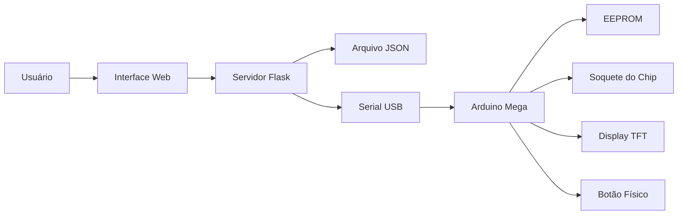
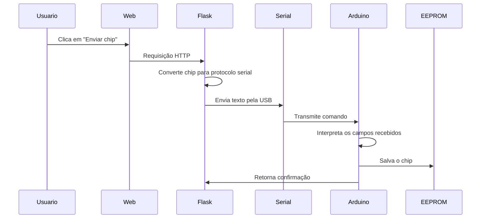

# Identificador de Chips 74xx - Microcontroladores

Projeto acadêmico para identificação automática de circuitos integrados da família **74xx**, utilizando **Arduino Mega 2560**, **interface web em Flask**, comunicação **Serial USB** e armazenamento persistente em **EEPROM**.

## Integrantes

- Bruno Tardin
- Matheus Marques
- Thiago Bello

---

## Visão Geral

O sistema permite cadastrar chips lógicos da série 74xx, definir seus pinos, criar baterias de testes e enviar essas informações para o Arduino.

Depois que os chips são cadastrados no Arduino, o sistema consegue identificar automaticamente um chip inserido no soquete. Para isso, o Arduino executa os testes cadastrados, compara os valores lidos com os valores esperados e exibe o resultado em um display TFT.

A arquitetura do projeto é dividida em duas partes principais:

1. **Aplicação Web com Flask**
   - Responsável pelo cadastro, edição, exclusão e organização dos chips e testes.
   - Salva os dados localmente em um arquivo JSON.
   - Envia os chips cadastrados para o Arduino pela comunicação serial.

2. **Sistema Embarcado no Arduino**
   - Recebe os dados enviados pelo Flask.
   - Interpreta o protocolo serial.
   - Salva os chips na EEPROM.
   - Executa os testes físicos nos pinos do chip.
   - Exibe o resultado da identificação no display TFT.

---

## Arquitetura Geral



---

## Responsabilidade de Cada Parte

| Parte | Responsabilidade |
|---|---|
| Interface Web | Permite cadastrar, editar, excluir e visualizar chips |
| Flask | Controla as rotas da aplicação e envia dados para o Arduino |
| JSON | Armazena os chips no computador para uso da interface web |
| Serial USB | Faz a comunicação entre Flask e Arduino |
| Arduino Mega | Interpreta comandos, salva chips, executa testes e controla o display |
| EEPROM | Guarda os chips enviados ao Arduino de forma permanente |
| Display TFT | Mostra mensagens, status e resultado da identificação |
| Botão físico | Inicia a identificação diretamente pelo Arduino |

---

## Fluxo de Cadastro

O cadastro de um chip começa na interface web.

O usuário informa:

- Nome do chip;
- Código do chip;
- Quantidade de pinos;
- Quais pinos são entradas;
- Quais pinos são saídas;
- Nomes opcionais para os pinos;
- Testes esperados para identificar o funcionamento do chip.

Na interface, os pinos de alimentação são tratados automaticamente:

| Quantidade de pinos | GND | VCC |
|---|---|---|
| 14 pinos | Pino 6 | Pino 13 |
| 16 pinos | Pino 7 | Pino 15 |

> Observação: o projeto usa numeração iniciando em `0`, conforme a implementação do sistema.

Depois do cadastro, os dados ficam salvos no lado web em um arquivo JSON. Isso permite que a interface liste, edite e gerencie os chips antes de enviá-los ao Arduino.

---

## Fluxo de Envio para o Arduino

Quando o usuário clica em **Enviar chip**, o Flask busca o chip salvo no JSON, converte suas informações para um protocolo textual e envia pela porta serial.

O navegador não se comunica diretamente com o Arduino. A comunicação acontece neste fluxo:



No Flask, a porta serial é mantida aberta enquanto possível. Isso evita que o Arduino reinicie toda vez que um novo chip é enviado.

A comunicação é feita com:

- Porta serial: `COM5`;
- Baud rate: `9600`;
- Envio em texto;
- Confirmação esperada do Arduino: `SALVO`;
- Indicação de falha: `ERRO`.

---

## Protocolo Serial

O protocolo enviado ao Arduino é uma string única, separada por `:`.

A estrutura geral é:

```text
CHIP:codigo:nome:qtdPinos:pino0:pino1:...:DIR:...:ESQ:...:TESTES:qtdTestes:teste1:teste2:...
```

Cada chip enviado contém:

- Código;
- Nome;
- Quantidade de pinos;
- Nome de cada pino;
- Tipos dos pinos do lado direito;
- Tipos dos pinos do lado esquerdo;
- Quantidade de testes;
- Valores esperados em cada teste.

Os tipos de pino seguem o padrão:

| Valor | Significado |
|---|---|
| `0` | Saída do chip, ou seja, o Arduino lê |
| `1` | Entrada do chip, ou seja, o Arduino escreve |
| `2` | Pino ignorado ou não classificado |

Nos testes, os valores seguem o padrão:

| Valor | Significado |
|---|---|
| `0` | Nível lógico baixo |
| `1` | Nível lógico alto |
| `2` | Não incluir no teste |

---

## Armazenamento no Lado Web

A aplicação Flask mantém uma base local em JSON.

Esse armazenamento é usado para:

- Listar chips cadastrados;
- Editar chips existentes;
- Excluir chips;
- Adicionar ou alterar testes;
- Enviar um chip específico para o Arduino.

Ou seja, o JSON funciona como a base da interface web.

Já a EEPROM funciona como a base persistente do Arduino.

---

## Armazenamento na EEPROM

O Arduino Mega possui **4 KB de EEPROM**, ou seja, **4096 bytes** de memória não volátil.

Essa memória é usada para armazenar os chips enviados ao Arduino. Como a EEPROM é não volátil, os dados continuam salvos mesmo após desligar o Arduino.

A organização atual da EEPROM é feita em blocos fixos:

```text
EEPROM Arduino Mega: 4096 bytes

[ Controle ][ Chip 1 ][ Chip 2 ][ Chip 3 ] ... [ Chip 14 ]
```

A primeira região da EEPROM é usada para armazenar o total de chips cadastrados. Depois dela, os chips são gravados em sequência.

No Arduino Mega, a área de controle ocupa **2 bytes**, pois armazena um valor inteiro com a quantidade total de chips.

Cada chip ocupa aproximadamente **273 bytes**, considerando a estrutura atual:

| Campo | Tamanho aproximado |
|---|---:|
| Nome do chip | 21 bytes |
| Código | 8 bytes |
| Quantidade de pinos | 2 bytes |
| Nomes dos pinos | 64 bytes |
| Tipos dos pinos da direita | 8 bytes |
| Tipos dos pinos da esquerda | 8 bytes |
| Quantidade de testes | 2 bytes |
| Até 10 testes com 16 valores cada | 160 bytes |
| **Total por chip** | **273 bytes** |

Com essa estrutura, a capacidade atual é:

```text
Capacidade = (4096 - 2) / 273
Capacidade = 14 chips
```

Portanto, o sistema consegue armazenar até **14 chips simultaneamente na EEPROM**.

---

## Por que a EEPROM é Organizada em Blocos Fixos?

A EEPROM não salva os chips como texto solto. Ela reserva espaços de tamanho fixo para cada cadastro.

Isso facilita o acesso porque o Arduino consegue calcular diretamente onde cada chip está armazenado:

```text
endereço do chip = início da área de chips + índice * tamanho do chip
```

Essa abordagem tem algumas vantagens:

- Evita procurar espaços livres manualmente;
- Facilita a leitura dos chips salvos;
- Reduz risco de sobrescrever dados incorretamente;
- Torna o carregamento inicial mais simples;
- Permite validar se a quantidade de chips está dentro do limite da EEPROM.

---

## Uso de RAM e EEPROM

A EEPROM é usada para armazenamento permanente.

A RAM é usada durante a execução do programa.

Quando o Arduino inicia, ele lê os chips salvos na EEPROM e carrega esses dados para uma lista em RAM. Assim, durante a identificação, o Arduino consegue percorrer os chips cadastrados de forma mais rápida, sem depender de leituras repetidas da EEPROM.

| Memória | Uso no projeto |
|---|---|
| EEPROM | Guarda os chips cadastrados de forma permanente |
| RAM | Mantém os chips carregados durante a execução |
| JSON | Guarda os chips no lado da aplicação web |
| Serial | Faz a troca de dados entre Flask e Arduino |

---

## Fluxo de Identificação

A identificação pode ser iniciada de duas formas:

- Pelo botão físico conectado ao Arduino;
- Pelo comando serial `Identificar`.

Quando a identificação começa, o Arduino percorre todos os chips carregados da EEPROM.

Para cada chip cadastrado, ele executa sua bateria de testes.

O processo geral é:

1. O Arduino libera os pinos usados anteriormente;
2. Aplica GND e VCC nos pinos de alimentação;
3. Configura os pinos de saída do chip como entrada no Arduino;
4. Aplica os valores nos pinos de entrada do chip;
5. Aguarda a estabilização dos sinais;
6. Lê os valores nos pinos de saída;
7. Compara os valores lidos com os valores esperados;
8. Repete o processo para todos os testes do chip.

Se todos os testes de um chip passarem, ele é considerado identificado.

Se algum teste falhar, o Arduino passa para o próximo chip cadastrado.

---

## Funcionamento dos Testes

Cada teste representa uma combinação lógica esperada.

Para cada pino, o teste pode indicar:

- Valor `0`;
- Valor `1`;
- Valor `2`, quando aquele pino não deve ser avaliado.

Durante a execução, o Arduino diferencia os pinos de entrada e saída:

| Tipo de pino | Ação do Arduino |
|---|---|
| Entrada do chip | Arduino configura como saída e escreve `0` ou `1` |
| Saída do chip | Arduino configura como entrada e lê o valor |
| VCC | Arduino aplica nível alto |
| GND | Arduino aplica nível baixo |
| Ignorado | Não participa da comparação |

A identificação só é confirmada quando todos os testes cadastrados para aquele chip são satisfeitos.

---

## Display TFT

O display TFT funciona como a interface visual do sistema embarcado.

Ele exibe:

- Mensagem inicial;
- Status de identificação;
- Quantidade de chips carregados;
- Resultado encontrado;
- Nome do chip identificado;
- Código do chip;
- Diagrama simplificado dos pinos.

Isso permite que o Arduino funcione de forma independente da interface web depois que os chips já foram enviados e salvos na EEPROM.

---

## Comandos Serial Suportados

Além da interface web, o Arduino também aceita comandos diretos pela serial.

| Comando | Descrição |
|---|---|
| `CHIP:...` | Cadastra um novo chip na EEPROM |
| `Identificar` | Inicia a identificação manualmente |
| `Selecionar:N` | Mostra informações do chip salvo na posição N |
| `Limpar` | Limpa o banco de chips da EEPROM |

---

## Estrutura do Projeto

A organização geral do código é dividida entre aplicação web e firmware do Arduino.

```text
projeto/
├── run.py
├── app/
│   ├── models.py
│   ├── storage.py
│   └── templates/
│       ├── index.html
│       ├── cadastrar.html
│       ├── editar.html
│       ├── testes.html
│       └── static/
│           ├── css/
│           │   └── style.css
│           └── js/
│               ├── chips.js
│               └── testes.js
└── identificador_chips.ino
```

### Aplicação Web

| Arquivo | Função |
|---|---|
| `run.py` | Inicializa o Flask, define as rotas e controla o envio serial |
| `models.py` | Define a estrutura dos chips, testes e conversão para o protocolo Arduino |
| `storage.py` | Lê e grava os chips no arquivo JSON |
| `index.html` | Tela inicial com a lista de chips |
| `cadastrar.html` | Tela de cadastro de chips |
| `editar.html` | Tela de edição de chips |
| `testes.html` | Tela de criação e edição dos testes |
| `chips.js` | Controla cadastro, edição, exclusão e envio de chips |
| `testes.js` | Controla adição, edição e remoção dos testes |
| `style.css` | Define a aparência da interface |

### Arduino

| Parte | Função |
|---|---|
| Leitura serial | Recebe comandos enviados pelo Flask |
| Interpretação do protocolo | Separa os campos da string recebida |
| EEPROM | Salva e carrega os chips cadastrados |
| Lista em RAM | Mantém os chips carregados para identificação |
| Mapeamento de pinos | Relaciona pinos do chip com pinos digitais do Arduino Mega |
| Execução dos testes | Aplica entradas e verifica saídas |
| Display TFT | Exibe status e resultado |
| Botão físico | Aciona a identificação |

---

## Tecnologias Utilizadas

### Hardware

- Arduino Mega 2560;
- Display TFT 2.4";
- Soquete para chips;
- Botão físico;
- Jumpers e protoboard;
- Chips lógicos da família 74xx.

### Software

- Python;
- Flask;
- JavaScript;
- HTML;
- CSS;
- Arduino IDE;
- Comunicação Serial;
- EEPROM;
- MCUFRIEND_kbv;
- Adafruit GFX;
- GFButton.


## Esquemático do Circuito


